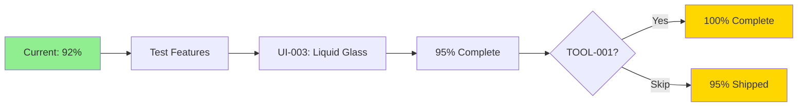

# 🚀 Next Steps - Quick Reference

**Project Status**: 92% Complete (24/26 tasks) ✨  
**Remaining**: 2 P2 tasks (~11-16 hours)

---

## 📋 What Just Happened

✅ **Documentation Cleanup** - Archived stale docs, clean repo  
✅ **MOD-001: Post Hiding** - Full feature with server sync  
✅ **MSG-002: Messages Polish** - 80-96% API call reduction  

**Files Changed**: 9 files (1 created, 8 modified)  
**Progress**: +7% in one session

---

## 🎯 Immediate Next Steps

### 1. Test What Was Built

```bash
# Test post hiding
# 1. Open app → Find a post → Tap menu (...)
# 2. Tap "Hide Post"
# 3. Verify post disappears from feed
# 4. Check toast shows "Post hidden"
# 5. Refresh feed → post stays hidden

# Test batch profile fetching
# 1. Open Messages tab
# 2. Check conversations load faster
# 3. Display names appear immediately
# 4. Check logs for "Batch fetch complete" message
```

### 2. Start UI-003 (Most Impactful)

**Liquid Glass Zoom Transitions** (3-4 hours)

```bash
# Review the plan
cat AGENTIC_EXECUTION_PLAN.md | grep -A 50 "ui-003"

# Key files to create/modify:
# - Catbird/Core/UI/Modifiers/GlassZoomTransition.swift (create)
# - Catbird/Core/Navigation/AppNavigationManager.swift (modify)

# Implementation:
# 1. Create ViewModifier using .glassEffectID
# 2. Add 120-180ms zoom animation
# 3. Test with Reduce Motion enabled
# 4. Profile with Instruments
```

### 3. (Optional) TOOL-001

**MCP Servers** (8-12 hours) - Developer tooling

Can be deferred if time-constrained.

---

## 📁 Key Documents

### Implementation Docs
- `MOD_001_POST_HIDING_IMPLEMENTATION.md` - Post hiding details
- `MSG_002_MESSAGES_POLISH_ANALYSIS.md` - Messaging analysis

### Planning
- `AGENTIC_EXECUTION_PLAN.md` - Task specs for UI-003 & TOOL-001
- `SESSION_SUMMARY.md` - Complete session overview

### Status
- `TODO.md` - Updated task list (92% complete)
- `TASK_COMPLETION_SUMMARY.md` - Progress metrics

---

## 🔧 Quick Commands

### Build & Test
```bash
# Syntax check
./swift-check.sh

# Build iOS (if needed)
xcodebuild -project Catbird.xcodeproj -scheme Catbird \
  -destination 'platform=iOS Simulator,name=iPhone 16 Pro' build

# Build macOS (if needed)
xcodebuild -project Catbird.xcodeproj -scheme Catbird \
  -destination 'platform=macOS' build
```

### Find Modified Files
```bash
# See today's changes
git status
git diff

# Files modified today:
# - Catbird/Features/Moderation/Services/PostHidingManager.swift (NEW)
# - Catbird/Core/State/AppState.swift
# - Catbird/Features/Feed/Services/FeedTuner.swift
# - Catbird/Features/Feed/Services/ContentFilterService.swift
# - Catbird/Features/Feed/Models/FeedModel.swift
# - Catbird/Features/Feed/Views/PostContextMenuViewModel.swift
# - Catbird/Features/Feed/Views/PostView.swift
# - Catbird/Features/Chat/Services/ChatManager.swift
```

---

## 📊 Current Stats

| Metric | Value |
|--------|-------|
| Overall Progress | 92% (24/26) |
| P0 Tasks | 100% (8/8) ✅ |
| P1 Tasks | 100% (11/11) ✅ |
| P2 Tasks | 71% (5/7) |
| Hours to 100% | 11-16 hours |

---

## 🎯 Path to 100%



**Fastest Path**: Test → UI-003 → Ship at 95%  
**Complete Path**: Test → UI-003 → TOOL-001 → 100%

---

## 💡 Pro Tips

1. **Test First** - Validate post hiding and profile fetching work
2. **UI-003 Next** - High user value, manageable scope
3. **Document As You Go** - Update completion docs
4. **Syntax Check Often** - `./swift-check.sh` after changes
5. **TOOL-001 Optional** - Dev productivity, can defer

---

## 🚀 Quick Win Strategy

### Session 1 (Today - 1 hour)
- ✅ Test post hiding thoroughly
- ✅ Test batch profile fetching
- ✅ Document any issues found

### Session 2 (3-4 hours)
- 🎯 Implement UI-003 (Liquid Glass zoom)
- 🎯 Test on iOS 26 simulator
- 🎯 Update TODO.md → 95% complete

### Session 3 (Optional - 8-12 hours)
- 🔧 Implement TOOL-001 (MCP servers)
- 🔧 Document usage
- 🔧 Update TODO.md → 100% complete

---

## ✅ Definition of Done

- [x] Documentation cleanup ✅
- [x] MOD-001 complete ✅
- [x] MSG-002 core optimization ✅
- [ ] Manual testing of implemented features
- [ ] UI-003 complete
- [ ] TOOL-001 complete (optional)
- [ ] All tests passing
- [ ] 100% task completion

---

**You're 92% there! Just polish and optional tooling left.** 🎉

*See SESSION_SUMMARY.md for complete details.*
